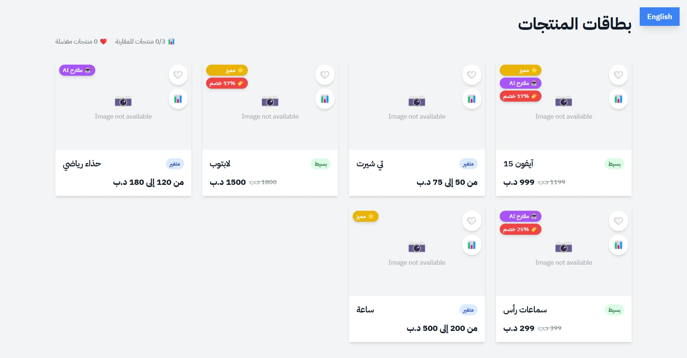
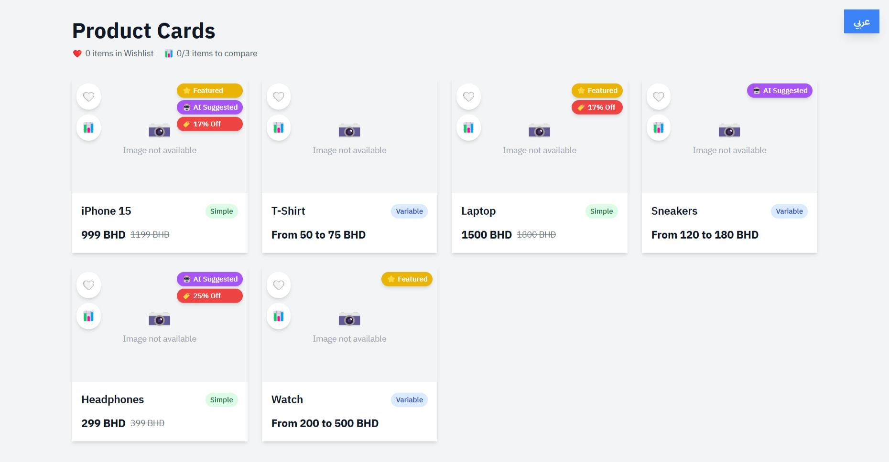

# Product Card UI - React Front-End Test

This project is a solution for a React Front-End Developer Test. It features a responsive, internationalized Product Card component built with React, Vite, TailwindCSS, and Zustand for state management. The application supports both English (LTR) and Arabic (RTL) languages.

## Preview

Here is a preview of the product cards in both English and Arabic layouts.




---

## Features

- **Product Card Component**: A reusable component that displays product information dynamically.
- **Localization (i18n)**: Full support for English (EN) and Arabic (AR), including RTL layout for Arabic.
- **Global State Management**: Uses Zustand to manage a global state for language, wishlist, and product comparison list.
- **Dynamic Price Display**:
  - For **Simple** products: Shows the final price, with a strikethrough on the original price if a discount is available.
  - For **Variable** products: Shows a price range (e.g., "From 50 BHD to 75 BHD").
- **Badges**:
  - Discount percentage badge.
  - "Featured" and "AI Suggested" badges.
  - Product type ("Simple" or "Variable").
- **Interactive Icons**:
  - **Like (Wishlist)**: Toggle a product's wishlist status (local state reflected globally).
  - **Compare**: Add/remove products from a comparison list, with a maximum limit of 3 products.
- **Enhanced UX**:
  - Smooth hover animations and visual feedback on interactive elements.
  - Image loading spinner and fallback UI for broken image links.
  - A persistent compare counter at the bottom of the screen.

---

## Tech Stack

- **Framework**: [React](https://reactjs.org/) (with Hooks)
- **Build Tool**: [Vite](https://vitejs.dev/)
- **Styling**: [TailwindCSS](https://tailwindcss.com/)
- **State Management**: [Zustand](https://github.com/pmndrs/zustand)
- **Package Manager**: [pnpm](https://pnpm.io/)

---

## Setup and Installation

Follow these steps to get the project up and running on your local machine.

### Prerequisites

- [Node.js](https://nodejs.org/) (version 16.x or higher)
- [pnpm](https://pnpm.io/installation)

### Installation Steps

1.  **Clone the repository:**
    ```bash
    git clone https://your-repo-url/product-card-test.git
    cd product-card-test
    ```

2.  **Install the dependencies:**
    ```bash
    pnpm install
    ```

3.  **Run the development server:**
    ```bash
    pnpm dev
    ```
    This will start the Vite development server. Open your browser and navigate to `http://localhost:5173` (or the URL provided in your terminal) to see the application.

---

## Notes on Localization Logic

The localization approach in this project is designed to be simple yet effective, fulfilling the test requirements.

1.  **Translation Files**:
    -   Translations are stored in simple JSON files located in the `src/i18n/` directory (`en.json` for English and `ar.json` for Arabic).
    -   This method avoids the overhead of a larger i18n library, which is suitable for a project of this scale.

2.  **State Management**:
    -   The current language (`'en'` or `'ar'`) is managed globally using a Zustand store (`useStore.js`).
    -   A `setLanguage` action allows any component to switch the language, and a `language` state variable provides the current language to all components.

3.  **Applying Translations**:
    -   In `App.jsx` and `ProductCard.jsx`, the appropriate translation object is selected based on the current language from the Zustand store:
        ```javascript
        const { language } = useStore();
        const translations = language === 'ar' ? arTranslations : enTranslations;
        ```
    -   Dynamic product data, like `product.name`, is accessed using the language key: `product.name[language]`.

4.  **RTL Support**:
    -   Right-to-Left (RTL) layout for Arabic is handled automatically.
    -   A `useEffect` hook in `App.jsx` sets the `dir` and `lang` attributes on the root `<html>` element based on the selected language.
        ```javascript
        useEffect(() => {
          document.documentElement.lang = language;
          document.documentElement.dir = language === 'ar' ? 'rtl' : 'ltr';
        }, [language]);
        ```
    -   TailwindCSS utility classes are used for RTL-aware styling (e.g., `flex-row-reverse`, `text-right`). This ensures that the layout adapts correctly when the language is switched.

This approach provides a clean and maintainable way to handle localization and RTL support without over-engineering the solution.